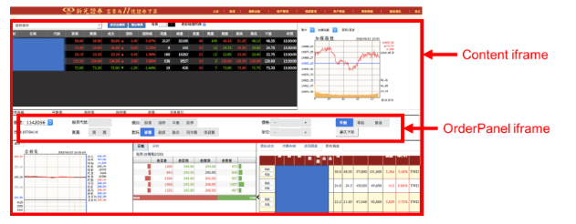

# 用 Python 超簡單自動下單

參考連接如下:

[用 Python 超簡單自動下單]: https://www.finlab.tw/%E9%80%9A%E7%94%A8%E8%87%AA%E5%8B%95%E4%B8%8B%E5%96%AE%E6%B3%95%EF%BC%88%E4%B8%8B%EF%BC%89/

分享如何用python自動下單！
只要用這種方式，不管您是用哪一個券商，相信都能自動下單的！
本文章使用新光證券為範例，其它券商就麻煩大家囉！

### 不負責聲明

本程式僅供教學用，有幾點必須要注意：

- 萬一新光證券改版，程式會無法使用喔！
- 不要在開盤的時候測試，不然就會直接買賣了喔0.0
- 在關市時實驗，記得要刪掉委託單喔！
- 不要在開盤的時候測試
- 不要在開盤的時候測試
- 不要在開盤的時候測試(很重要！多加幾行XD)

### 使用Selenium

這是一個網頁自動化工具，通常是拿來測試網頁用，但是拿來下單也可以！
我們用它是因為它支援javascript，實做起來就像是按鍵精靈一樣，比較簡單一點！

安裝方法請參考[Selenium](https://selenium-python.readthedocs.io/installation.html#downloading-python-bindings-for-selenium)

除了`pip install selenium`以外，還必須要下載driver才行喔！
driver 就是一個控制瀏覽器的接口，可以挑chrome、firefox等來用。

### 自動登入

安裝好了之後，我們先來分析下新光金控的下單流程：

1. 連結到[新光證券富貴角](https://w.sk88.com.tw/Cross/Pc/Login.aspx)
2. 輸入帳密
3. 按「登入」

人工執行很簡單，但是要python執行怎麼寫呢？

首先，雖然人眼看到的是網頁，但程式看到的，都是代碼，
所以輸入帳密時，我們必須找出代碼中，對應到帳密的欄位進行填寫，
可以對著欄位按右鍵，查找該欄位的ID


於是我們就有了第一段程式碼（可以從第30行開始看就好了）：

```


# 1. webdriver: 就是瀏覽器的介面，可以操控瀏覽器
# 2. EC、WebDriverWait：我們可以用WebDriverWait等待EC的條件成立，才執行某些動作
# 3. By：寫條件的時候，用By來獲取網頁上的元素
from selenium import webdriver
from selenium.webdriver.support import expected_conditions as EC
from selenium.webdriver.support.ui import WebDriverWait
from selenium.webdriver.common.by import By

# 用來填寫表單的function
def text_input(driver, idname, text):

    # 確認欄位id存在
    field = WebDriverWait(driver, 10).until(
        EC.presence_of_element_located((By.ID, idname))
    )
    # 清空並填入欄位
    field.clear()
    field.send_keys(text)

# 等 idname 按鈕出現時，按一下
def wait_then_click(driver, idname):

    # 確定按鈕存在
    element = WebDriverWait(driver, 10).until(
        EC.presence_of_element_located((By.ID, idname))
    )
    # 按一下
    element.click()

# 打開瀏覽器，並到登入的網址
driver = webdriver.Firefox(executable_path='你的driver的位置')
driver.get('https://w.sk88.com.tw/Cross/Pc/Login.aspx')

# 填入帳號密碼，按確認
text_input(driver, 'TxtIDNo', '你的帳號')
text_input(driver, 'TxtPass', '你的密碼')
wait_then_click(driver, 'Button1')
```

第30行才開始執行按鍵精靈的功能，假如前面看不懂就省略吧XD
以上代碼和解釋就請大家自行讀取囉！

### 但事情沒那麼簡單…

登入後就看到一行：本機無有效憑證，故無法網路下單，僅提供看盤資訊。


但我們就是想要網路下單呀！所以，只能來個自動匯入憑證了！

```
# 按一下確定
wait_then_click(driver, 'Button1')

# 匯入憑證（windows裡面的路徑要改成反斜線喔！「C:\hello\something\SKIS_xxx.pfx」之類的）
driver.find_element_by_id("FileUploadCert").send_keys('/Users/放哪都可以/Documents/SKIS_xxx.pfx')
text_input(driver, 'TxtCertPass', '你的密碼')

# 按「確認」
wait_then_click(driver, 'BtnImport')
wait_then_click(driver, "jqismooth_state0_button確　 認")
```

接下來我們又跳回到登入頁面了，所以再登入一次就可以下單囉！

```
import time
time.sleep(3)
text_input(driver, 'TxtPass', '你的帳號')
text_input(driver, 'TxtIDNo', '你的密碼')
wait_then_click(driver, 'Button1')
```

為什麼這邊要用`time.sleep`呢？
我也很想避免，但可能是page loading完，有一些javascript要驗證，
所以不能太快填寫表單，不然會被清除，加了sleep等待javascript驗證完畢，才能使用，
經過了百般折騰，我們終於可以正式的來下單了！

### 下漲停單

接下來就來示範漲停單，首先這個頁面，是非常可怕的連環[iframe](http://www.w3school.com.cn/html/html_iframe.asp)所包成的
什麼是iframe呢？白話來說就是網頁中的網頁，的意思…
所以這個下單介面，就是網頁包網頁包網頁，如下圖：



我們必須再深入兩層iframe，才能到達下單的真正網頁：

```
driver.switch_to_default_content()

WebDriverWait(driver, 10).until(EC.presence_of_element_located((By.NAME, "Content")))
driver.switch_to.frame('Content')

WebDriverWait(driver, 10).until(EC.presence_of_element_located((By.ID, "OrderPanel")))
driver.switch_to.frame('OrderPanel')
```

接下來就可以利用這個iframe下單了，總共有七個步驟，以漲停買入為例，如下圖：


這邊要注意第三跟五的步驟，我們要等待特定的事件發生，才能繼續進行喔！
因為這關係到網頁與新光證券的伺服器中間的認證，沒有等待就下不了單喔！

接下來就把這七個步驟寫成代碼：

```
stock_id = '2330'
bs = 'buy'
amount = 1

# 第一步驟
text_input(driver, 'TxtSymb', stock_id)

# 第二步驟
btnbs_xpath = "//span[@id='RdoOrls']/label/span" if bs == 'buy' else "//span[@id='RdoOrls']/label[2]/span"
driver.find_element_by_xpath(btnbs_xpath).click()

# 第三步驟
if bs == 'buy':
    WebDriverWait(driver, 10).until(EC.presence_of_element_located((By.XPATH, "//body[@style='background: rgb(255, 192, 203) none repeat scroll 0% 0%;']")))
else:
    WebDriverWait(driver, 10).until(EC.presence_of_element_located((By.XPATH, "//body[@style='background: rgb(167, 217, 254) none repeat scroll 0% 0%;']")))

# 第四步驟
btnlimit_xpath = "//span[@id='RdoOrpt']/label[2]/span" if bs == 'buy' else "//span[@id='RdoOrpt']/label[4]/span"
driver.find_element_by_xpath(btnlimit_xpath).click()

# 第五步驟
if bs == 'buy':
    WebDriverWait(driver, 10).until(EC.presence_of_element_located((By.XPATH, '//input[@id = "TxtOrpr" and @value = "漲停價"]')))
else:
    WebDriverWait(driver, 10).until(EC.presence_of_element_located((By.XPATH, '//input[@id = "TxtOrpr" and @value = "跌停價"]')))

# 第六步驟
text_input(driver, 'TxtOrsh', str(amount))

# 第七步驟
driver.execute_script('QueryConfirm()')
wait_then_click(driver, 'jqismooth_state0_button確　 認')
wait_then_click(driver, 'jqismooth_state0_button離　 開')
```

這邊我有用一些xpath的方式，來查找一些按鈕，可以參考[xpath教學](https://zh.wikibooks.org/zh-hant/XML/XPath)
假如已經事先登入，執行這7個步驟，大約落在3秒左右，應該還算是堪用，
但以上範例都是用漲停或是跌停買賣，而且我真的沒有在盤中使用過，還請小心服用！

以上就是盤中買賣**不負責**教學！不知道大家有什麼建議呢？

[4. 定位元素]: https://selenium-python.readthedocs.io/locating-elements.html

